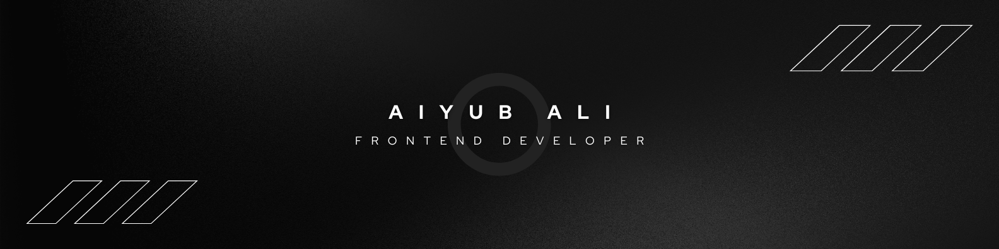

  

<!-- PROFILE VIEWS -->
<!-- 
  
 -->

<!-- BANNER -->

<!-- WORK TIME -->

<!-- <h2 align="center">🔰 OverView 🔰</h2> -->
<h3 align="center">👋ٱلسَّلَامُ عَلَيْكُمْ وَرَحْمَةُ ٱللَّٰهِ وَبَرَكَاتُهُ</h3>
<h4 align="center">I'm Aiyub Ali.</h4>
<h3 align="center">A passionate learner of web development.</h3>

 
  
  🌱 I’m currently working on a project.
   
  💻 I’m a **Tech Enthusiast** person.
   
  💬 Talk to me about **React, JavaScript, Next.js, Tailwind, Tech Related Topic**, etc.

  

<h2 align="center">Contact with me:</h2>

<!--  -->

  
  <!--  -->
  

<h2 align="center">⚒️ Familiar-Tech/Skills ⚒️</h2>
 

<a href="">
  
   
  
</a>
  

<h2 align="center">⚡ Stats ⚡</h2>
 

  

  

<!---

--->

<h2 align="center">Snake Animation of GitHub Contributions</h2>
<picture>
  <source media="(prefers-color-scheme: dark)" srcset="https://raw.githubusercontent.com/MAAB-FW/MAAB-FW/output/github-contribution-grid-snake-dark.svg">
  <source media="(prefers-color-scheme: light)" srcset="https://raw.githubusercontent.com/MAAB-FW/MAAB-FW/output/github-contribution-grid-snake.svg">
  
</picture>

<!---

  
  
  
  
  
  
  
  
  
  
  
  
  

--->

<!---
- 👋 Hi, I’m @MAAB-FW
- 👀 I’m interested in ...
- 🌱 I’m currently learning ...
- 💞️ I’m looking to collaborate on ...
- 📫 How to reach me ...
- 😄 Pronouns: ...
- ⚡ Fun fact: ...

MAAB-FW/MAAB-FW is a ✨ special ✨ repository because its `README.md` (this file) appears on your GitHub profile.
You can click the Preview link to take a look at your changes.
--->
